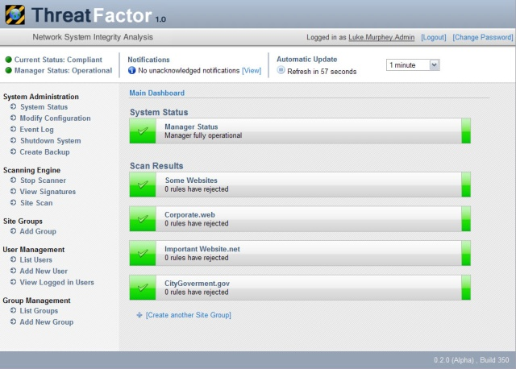
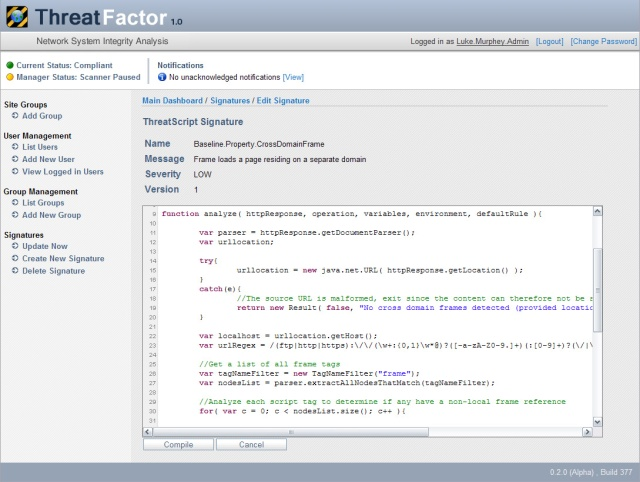
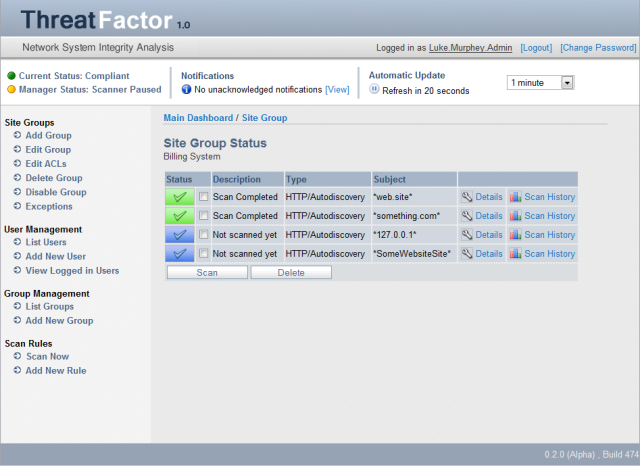
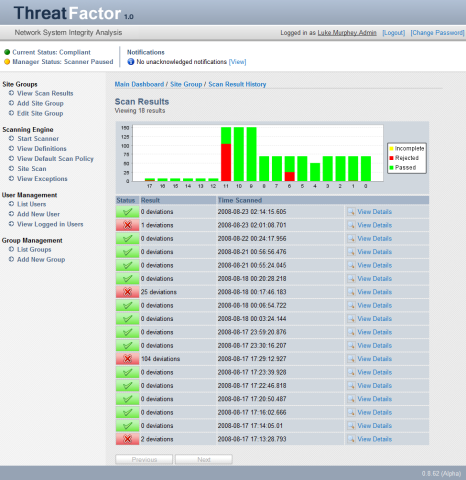
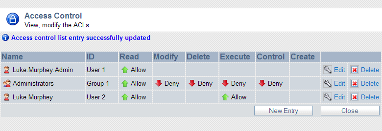
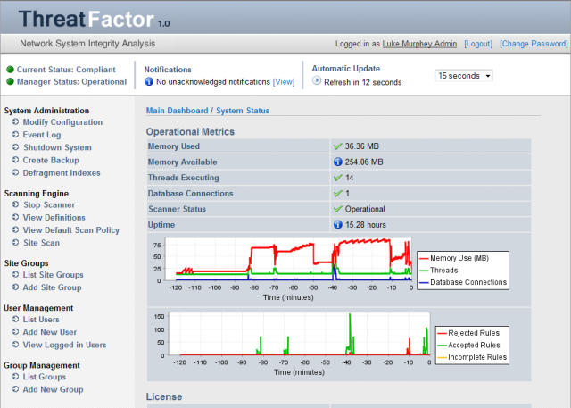
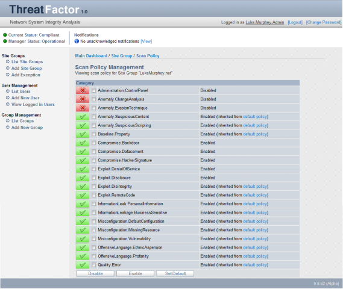
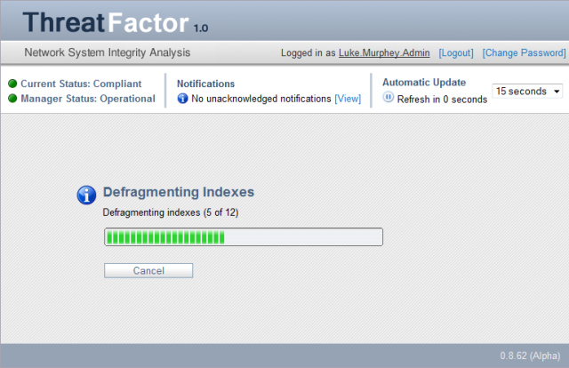

# NSIA: Network System Integrity Analysis

NSIA is an application for detecting defacements, errors, information leaks and other types of security problems on websites and web applications (think of it as a "website IDS").

See http://threatfactor.com

## Screenshots

### Overview Dashboard ###

The main dashboard clearly displays the status of the scanner and of the monitored websites. 

### Scan Result Report ###

Scan reports indicate what resources were discovered and provides details on what issues were observed. 

### ThreatScript Signature ###

ThreatScript signatures perform deep content analysis and can detect significant changes. 

### ThreatPattern Signature ###

ThreatPattern signatures can identify known-bad elements such as attacks, offensive language and information leaks. 

### Rule Status Overview ###

The rule status page shows indicates the current state of each rule; including which have found issues, were unable to scan (for example, due to an outage in the webserver) or those rules that have not been scanned yet. 

### Rule History Overview ###

The rule history page displays the status of past scans. 

### Access Control ###

NSIA was designed for multiple users and supports sophisticated access controls.

### System Status ###

The system status page displays the operational status of the scanner, including memory usage, number of threads, number of rules evaluated, etc.

### Scan Policy Management ###

Individual scan policies can be defined in order to tailor the scans according to the websites begin scanned. 

### Integrated Database ###

NSIA features a built-in database (no DBA required). NSIA maintains the database by creating backups, defragmenting indexes, etc. You can also use an external database instead. 
